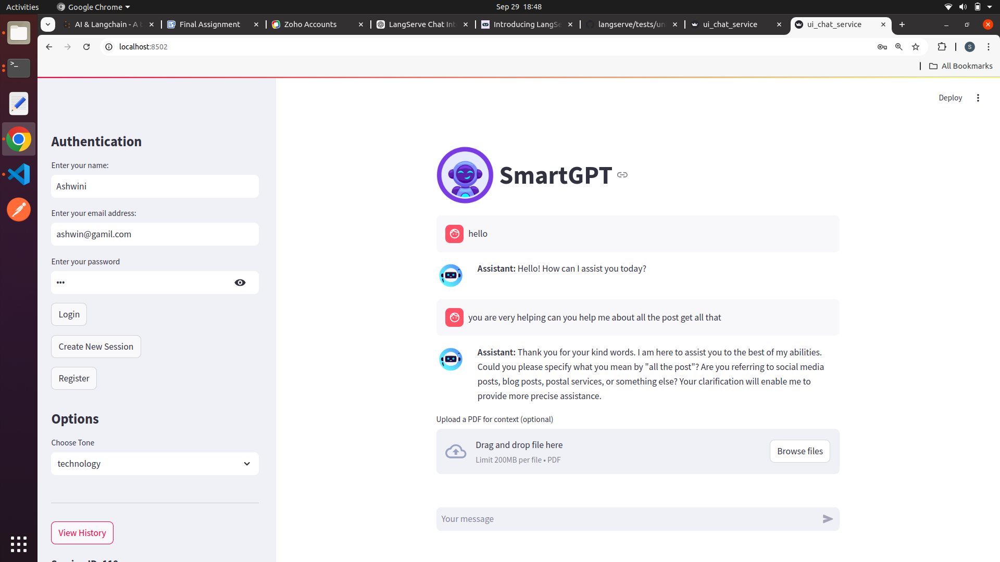

# SmartGPT

## SmartGPT: Intelligent Conversational Assistant

**SmartGPT** is an advanced conversational AI application designed for engaging and meaningful interactions between users and a sophisticated chatbot. Built using Streamlit and FastAPI, it offers an intuitive interface that makes communication seamless.

Key features include **dynamic tone selection**, allowing users to customize the chatbot's responses to suit various contexts, from formal to casual. SmartGPT also enables **real-time data retrieval**, ensuring users receive accurate information on topics such as flights and weather updates.

A standout feature is the **PDF contextual querying**, where users can upload documents, allowing the chatbot to answer questions based on their content. This is particularly beneficial in academic and professional settings.

SmartGPT supports **session management**, enabling users to create and view multiple chat sessions, ensuring continuity in their interactions. With secure user authentication, users can easily register and log in, fostering a safe environment for discussions.

Overall, SmartGPT combines powerful natural language processing with user-centric features, making it an ideal tool for customer support, education, research, and personal assistance.


# SmartGPT Frontend

## Description
The frontend for SmartGPT is built using **Streamlit**, providing a simple, interactive user interface to interact with the SmartGPT chatbot. It allows users to upload PDFs for context, select a tone for conversation, and manage sessions. Users can register, log in,craete new sessions and view their chat history.

## Features
- **User Authentication**: Users can register, log in, and create new sessions.
- **Tone Selection**: Users can choose the tone of conversation (e.g., formal, casual).
- **File Upload**: Upload PDF files for contextual question-answering.
- **Session Management**: Create new sessions, view chat history, and manage ongoing sessions.
- **Chat Interface**: Interactive chat with the assistant that adapts based on user preferences.

## Technologies Used
- **Streamlit**: For the frontend interface.
- **FastAPI**: Backend API interaction (not covered in this README).
- **Python**: For handling logic and requests to the backend.
   

### Authentication
- **Register**: Enter your name, email, and (optional) password to create a new user.
- **Login**: Enter your registered name, email, and password to log in.

### Session Management
- **Create New Session**: Start a new conversation session with the chatbot.
- **View History**: View previous chat history (available after logging in).

### Tone Selection
- Choose the tone of the chatbot's response from the dropdown menu (e.g., `formal`, `casual`).
- For real-time data, it is imperative to select the real-time option. This choice ensures that the information provided is up-to-date and accurate. For instance, if one inquires about the available flights from Destination A to Destination B within the last 24 hours, the system will deliver the most current and precise data.

### Modify Tone Options
If you wish to add more tones, modify the dropdown options in the Streamlit app's sidebar.

```python
tone_options = ["formal", "casual", "friendly", "sarcastic"]
st.selectbox("Choose Tone", tone_options)
```

### API Integration
Ensure that your backend API (FastAPI) is running and accessible at the defined endpoint.

## Screenshots



---

# SmartGPT Backend

## Description
The SmartGPT backend is a robust and scalable system developed using **FastAPI**, leveraging modern AI technologies to deliver intelligent and contextually relevant responses through an interactive chatbot interface. The architecture incorporates various powerful libraries, including **LangChain** for conversational AI, **Azure OpenAI** for advanced language models,**Tavily** which is a swearch engine optimized for LLMs and RAG, aimed at efficient, quick, and persistent search results and **PostgreSQL** for efficient data storage and retrieval.

## Features
- **User Management**: Users can register, log in, and manage their profiles.
- **Session Management**: Create and manage chat sessions, view session history.
- **Customizable Responses**: Allows users to select different tones for the chatbot's responses (e.g., formal, casual).
- **Real-Time Data Retrieval**: Integrates with external APIs for real-time information.
- **PDF Querying**: Supports uploading PDFs to enhance the chatbot's context and knowledge base.

## Technologies Used
- **FastAPI**: For building the backend APIs.
- **SQLAlchemy**: For database interactions with PostgreSQL.
- **PostgreSQL**: For storing user data, session details and Chat History
- **PGVector**: For similarity search with embeddings.
- **LangChain**: For handling language model interactions and retrieval-augmented generation.

## Installation

1. Clone the repository:
   ```bash
   git clone https://github.com/Suwarrna-2001/SmartGPT.git
   ```

2. Install the dependencies:
   ```bash
   poetry install

   ```
   - **`poetry install`**: This command will install the dependencies specified in your `pyproject.toml` file. If you haven't locked your dependencies yet, you can do so with `poetry lock`, but typically, running `poetry install` will automatically handle that for you.

   ```
3. Navigate to the project directory:
   ```bash
   cd SmartGPT-Backend
   ```
4. Create a virtual environment and activate it:
   ```bash
   poetry shell
   ```
   
5. Set up the `.env` file with the following keys:
   ```bash
   AZURE_OPENAI_API_KEY=<Your Azure OpenAI Key>
   AZURE_OPENAI_ENDPOINT=<Your Azure OpenAI Endpoint>
   TAVILY_API_KEY=<Your Tavily API Key>
   CONNECTION_STRING=<Your PostgreSQL Connection String>
   ```

6. Start the FastAPI application(Backend):
   ```bash
   poetry shell
   uvicorn app:app --host 127.0.0.1 --port 3003
   ```

7. Run the Streamlit application:
   ```bash
   poetry shell
   cd services
   streamlit run ui_chat_service.py --server.port 8502
   ```
   

## Running the Application

1. Run the FastAPI application:
   ```bash
   uvicorn app:app --reload
   ```
   
2. Access the API documentation in your browser at `http://localhost:3003/docs`.

## API Endpoints

### User Management
- **POST /register-user**: Register a new user with name and email.
- **POST /login**: Authenticate a user and create a session.

### Session Management
- **POST /session**: Create a new chat session.
- **GET /user/{user_id}/sessions**: Retrieve all sessions for a specific user.
- **GET /messages/{session_id}**: View chat history for a specific session.

### Normal Quering:
- **POST /talk-to-bot**: API endpoint processes user queries by invoking a conversational chain based on the provided session ID and tone, returning intelligent responses from the chatbot.
### PDF Querying
- **POST /up**: Upload a PDF for contextual question-answering.
- **POST /query-pdf**: Query the uploaded PDF for specific information.

### All Sessions:
- **GET /all-sessions**: Returns all the sessions 
- **GET /all-users-info**: Returns all the info of the registered users.


## Database Structure
The application uses PostgreSQL with the following tables:

- **User Table**: Stores user information.
- **Session Table**: Manages user sessions linked to their chat history.

## Refer: 
- For more technical details of the application refer my blog https://www.langchain.ca/blog/ghost/#/editor/post/66ffdeeb5332230b725f8be7
- To safeguard your sensitive and private data from LLMs refer my blog https://www.langchain.ca/blog/ghost/#/editor/post/66fe5b755332230b725f8b43 and to see the code base refer my github repository https://github.com/langchain-tech/guardrails-demo
- To learn about sentiment analysis on broad spectrum refer my github repository https://github.com/langchain-tech/sentiment-analysis-demo/tree/main
